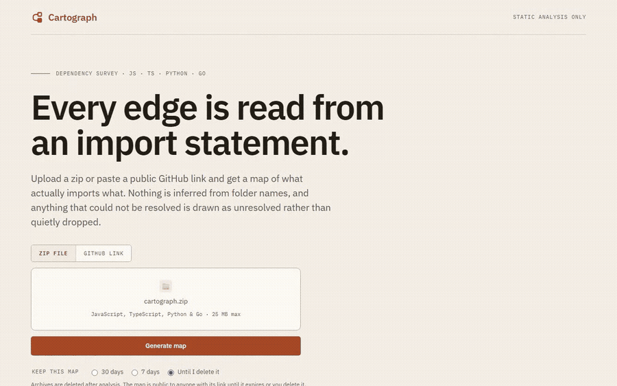
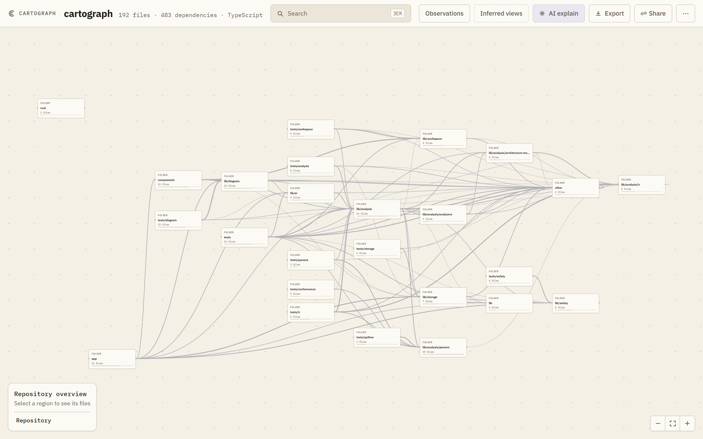
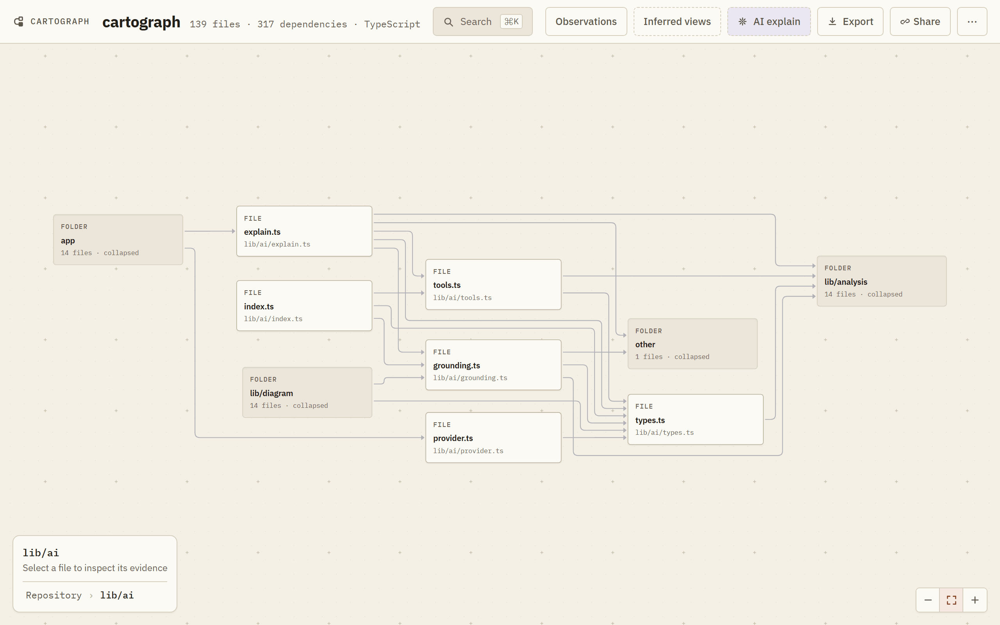
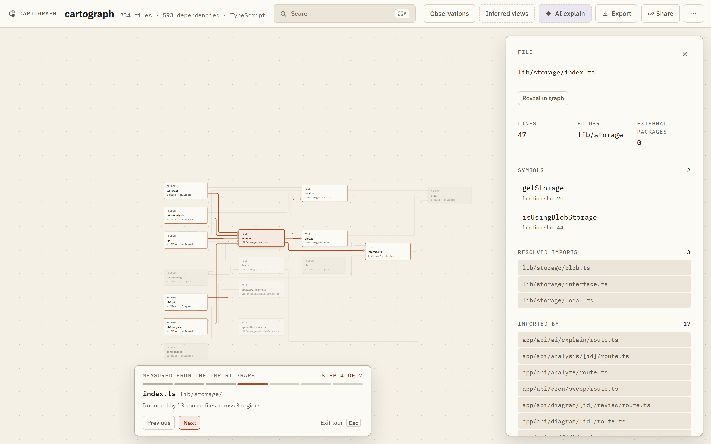
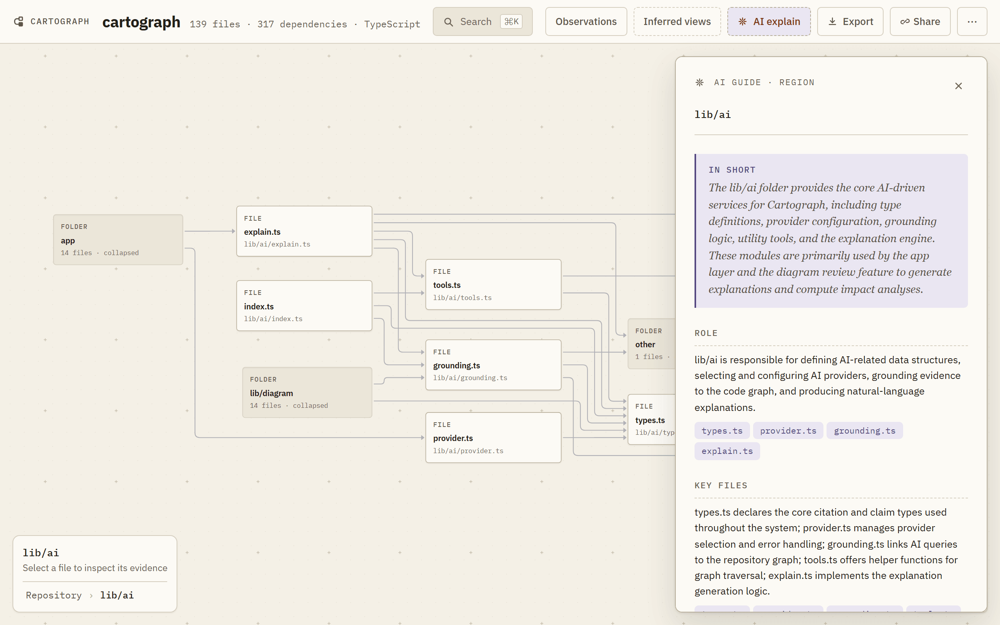
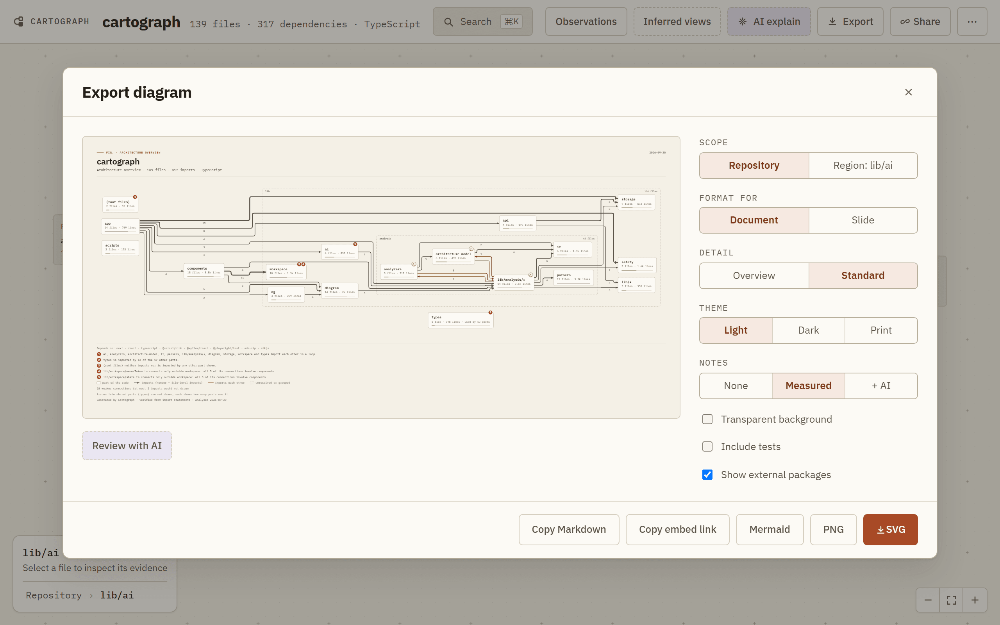
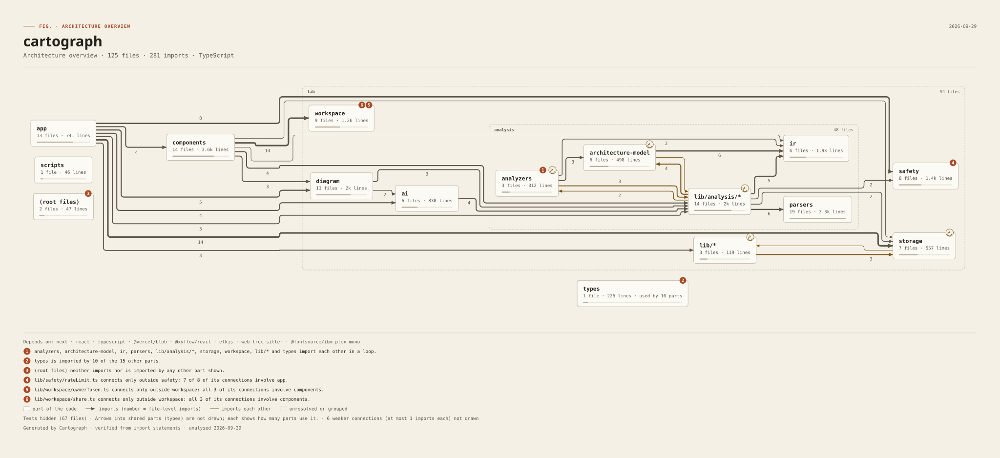
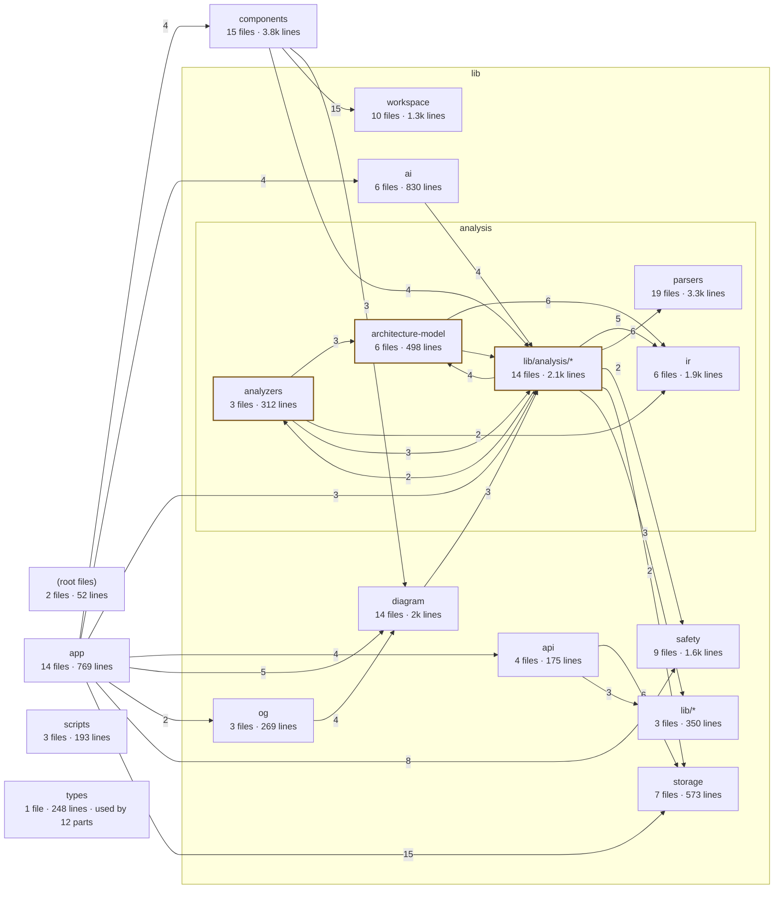

<table align="center">
  <tr>
    <td align="center" bgcolor="#F4F0E6" width="112" height="112">
      
    </td>
  </tr>
</table>

<h1 align="center">Cartograph</h1>

<p align="center">
  <strong>Verified dependency maps for real codebases.</strong><br />
  Drop a zip or paste a GitHub link. Read its architecture. Follow every measured edge.
</p>

<p align="center">
  <a href="https://cartograph-dev.vercel.app"><strong>Try it at cartograph-dev.vercel.app</strong></a>
</p>

<p align="center">
  <a href="#what-you-get">Features</a> ·
  <a href="#the-guided-tour">Guided tour</a> ·
  <a href="#the-ai-guide">AI guide</a> ·
  <a href="#safety-and-limits">Safety</a> ·
  <a href="#run-locally">Run locally</a>
</p>

<p align="center">
  
</p>

Cartograph turns a JavaScript, TypeScript, Python, or Go repository, uploaded
as a `.zip` or fetched from a public GitHub link, into a shareable,
interactive dependency map. Every edge on the map comes from an
import statement in the source. Nothing is guessed from folder names, and
uploaded code is never executed.

When an import cannot be resolved, Cartograph draws it as unresolved instead
of dropping it. A missing edge and an edge to nowhere are different facts.

## What you get

### A map with two altitudes

Start with a region-level survey of the whole repository, then open a region
to see its file-level dependencies. Imports that cross into another region stay
visible as boundary markers, so following an edge never dead-ends.





### Evidence you can see

Every node and edge carries the confidence of the fact behind it:

| Mark | Meaning |
| --- | --- |
| `verified` | Directly observed in source. |
| `derived` | Computed deterministically from verified facts, with lineage. |
| `heuristic` | Best effort. May be wrong. |
| `unknown` | The dependency exists, but its target could not be determined. |
| `assisted` | Generated interpretation. Never drawn as graph geometry. |

Confidence never increases as data moves through the pipeline.

### Structural observations

Inspect import cycles, dependency hubs ranked by how many files import them,
and files nothing imports. Each observation traces back to the graph that
produced it. Unlike measurements are never collapsed into one severity score.

### Entry points and reachability

Cartograph recognises where a repository starts and follows imports from
there. Two lenses in **Observations** show the result:

- **Entry points**, grouped by the rule that matched, so you can see why a
  file counts as a start and disagree.
- **Unreachable from entry points**: files with no import path from any
  recognised entry point.

Selecting a file also says, in the inspector, whether it is an entry point
(and by which rule) or has no import path from one. See
[Reachability](#reachability).

### A guided tour

Press **Take the tour →** on any map's overview to walk through the handful
of files worth reading first, one step at a time. See
[The guided tour](#the-guided-tour).

### An AI guide to unfamiliar code

Ask for a plain-language tour of the whole repository, a region, or a single
file. See [The AI guide](#the-ai-guide).

### A workspace for investigation

Search files, named symbols, and packages. Open a file to follow its imports
and importers, inspect confidence evidence, and retrace your steps with the
breadcrumb and investigation trail. Every position has a URL, so a link opens
exactly what you were looking at.

In the file view, each arrow follows an orthogonal route computed with ELK and
leaves and enters its file through its own port, so parallel imports stay
separate. If you drag a file away from its route, the arrow falls back to a
simpler path.

### Presentation-ready diagrams

Export the architecture as a figure you can drop into a README, design doc,
or slide: grouped by folder, arrows weighted by import count, with a legend,
a note of anything left out, and a line saying where it came from. Choose the
Document or Slide preset, optionally add an AI review, then download SVG or
2× PNG, copy Mermaid for GitHub, or embed a live image link.

## Using it

Choose **Zip file** and drop a project archive, or choose **GitHub link** and
paste a public repository: `owner/repo`, `github.com/owner/repo`, or
`github.com/owner/repo/tree/<branch>` for another branch or tag. Cartograph
fetches the repository's source archive from GitHub (public repositories only,
up to 25 MB) and maps it the same way as an upload. Maps from GitHub carry a
link back to the repository. Full `https://github.com/...` URLs work too.
`/?github=owner/repo` opens the form pre-filled, so
a README badge can point at it; it never submits on its own.

### Retention and deletion

Choose how long a map is kept when you create it: 7 days, 30 days (the
default), or until you delete it. The uploader's browser receives a private
delete link once; the store keeps only its hash, so a share link cannot delete
anything. A daily cron (`/api/cron/sweep`, `vercel.json`) removes expired maps
and requires `CRON_SECRET`; without it the sweep returns 503 and nothing
expires.

### Link previews

Repo pages carry Open Graph and Twitter metadata. `/api/og/<id>` serves a
1200×630 PNG: the architecture figure, or a summary card for repositories too
small for a useful figure. Repo pages are marked `noindex`; maps are shared by
link, not listed by search engines.

## How it works

1. You upload a repository as a `.zip`, or paste a public GitHub link.
2. Cartograph validates the archive and discovers source files.
3. Language parsers extract imports, declarations, and parse errors.
4. The pipeline builds a validated intermediate representation and a
   deterministic dependency graph.
5. Entry points are recognised and reachability is computed over the graph.
6. Regions, observations, and layout are computed from that graph.
7. The result is saved at `/repo/<id>` and can be shared directly.

The same repository always produces the same graph, ordering, and derived
records.

### Supported languages

| Language | Extensions | Parser |
| --- | --- | --- |
| TypeScript / JavaScript | `.ts` `.tsx` `.js` `.jsx` | TypeScript compiler API |
| Python | `.py` | tree-sitter Python (WASM) |
| Go | `.go` | tree-sitter Go (WASM) |

All parsers index named declarations. The symbol index is not a call graph:
the map stays file-level and import-based.

Path aliases from `tsconfig.json` or `jsconfig.json` are resolved, and
re-exports are followed. Python import roots come from declared layouts when
available; structural guesses are recorded as lower-confidence evidence. Go
package imports resolve to a deterministic representative file and are marked
heuristic when the package has several source files.

## Reachability

Reachability answers one question: which files can be reached by following
imports from where the repository starts?

**Entry points** are found by recognised conventions, and each one records
the rule that matched:

| Source | Rules |
| --- | --- |
| `package.json` | `main`, `module`, `bin`, `browser`, and literal `exports` targets (a built `.js` target is traced back to its `.ts` source) |
| Frameworks | Next.js `app/` and `pages/` routes, `middleware`, `proxy`, `instrumentation` |
| Python | `pyproject.toml` scripts, `__main__.py`, `manage.py`, `wsgi.py`, `asgi.py`, `setup.py`, and `if __name__ == "__main__":` |
| Go | `package main` |
| Conventions | Root `index`/`main`/`server`/`app`/`cli` files, tests, config files, Storybook stories, examples, benchmarks, and scripts |

A breadth-first search then follows resolved imports from those files. A file
it never reaches is listed as having **no import path from any recognised
entry point**. That is a measurement, not a verdict. The file may still be
loaded by something the analysis cannot see, so the lens states what could
hide a path:

- files that use dynamic or non-literal `import()`/`require()`
- internal imports that could not be resolved
- a file-routed framework whose conventions Cartograph does not recognise
  (a nested package using one is skipped, not reported)
- wildcard `exports` patterns, whose matches may be public API

With no recognised entry point there is nowhere to start, so nothing is
reported rather than every file looking unreachable. The AI overview receives
the same counts and caveats, and is told never to call a file dead or unused.

## The guided tour

**Take the tour →** appears on a map's overview once there are at least two
steps worth taking. Each step moves the map to one file, opens its inspector,
and says why the file is on the tour.



A tour comes from one of two sources, and the card always says which:

| Source | How the steps are chosen |
| --- | --- |
| Measured from the import graph | Up to 7 steps: one or two primary entry points (a package's `main` or `bin`, the root layout and page) ahead of API routes, exports subpaths, and scripts; then the most-imported files, spread across regions where possible; then the most connected file in each large region not yet visited. Tests, examples, docs, config, and type-only files are skipped. |
| Guided by AI, with cited files | The AI overview's reading order, up to 10 steps. Files that are not in the analysis are dropped. |

If an AI overview is already loaded, the tour follows its reading order.
Otherwise it starts from the measured steps, and **Use AI reading order**
switches over (this asks the AI provider). The AI panel's overview also has a
**Take the tour** button.

Use **Previous** and **Next** or the arrow keys, and **Esc** or **Exit tour**
to leave. Each step has its own URL (`?tour=3`), so browser Back and Forward
move through the tour, and a shared link opens the measured tour on that step.

## The AI guide

Open **AI explain** to get a guided explanation of whatever you are looking
at:

| Subject | What it covers |
| --- | --- |
| Repository | What the project likely does, how its regions divide the work, how they connect, where complexity concentrates. |
| Region | What the region is responsible for, its key files, and what it depends on and is used by. |
| File | What the file is for, what it relies on, what relies on it, and what could break if it changes. |

Each explanation starts with a short summary, is organized into sections, and
ends with a reading order: the files to open first, and why. Every point links
to the files, imports, or regions it rests on, and clicking one moves the map
there. The repository overview's reading order can be walked as a
[guided tour](#the-guided-tour).



### How answers are kept honest

The model interprets the graph. It never adds to it.

- **Bounded evidence.** The model receives a fixed-size evidence set built
  from the measured graph: counts, key files, declared names, cross-region
  imports, and cycles. Prompt size does not grow with the repository.
- **Citations are checked.** A point is shown only if every citation names a
  file, import, or region that exists in that evidence set.
- **Figures are checked.** A point that states a number not present in the
  evidence is removed. The panel tells you how many points were removed.
- **Fallback, not failure.** If a provider's answer has nothing grounded left,
  the next provider is tried.

Citations prove what a point rests on, not that its wording is right, and the
panel says so.

### Providers

Cartograph calls free-tier providers in this order, skipping any that are
unconfigured and moving past any that fail:

1. Gemini
2. Groq
3. OpenRouter

A provider that has just rate-limited or overloaded is tried last until its
cooldown passes. Explanations are cached per analysis and subject, so opening
the same explanation again costs no quota. **Regenerate** bypasses the cache.
Provider keys stay on the server.

## Export diagrams

Press **E** (or **Export**) in the workspace.



This is Cartograph's own architecture, exported by Cartograph:



The same figure as Mermaid, which GitHub renders inline:



| Choice | Options |
| --- | --- |
| Format for | Document (wide, for READMEs and docs) or Slide (1920×1080) |
| Detail | Overview (top-level parts) or Standard (large folders split into their sub-folders) |
| Theme | Light, Dark, or Print (no colour; cycles are dashed) |
| Output | SVG, PNG at 2×, Mermaid, Markdown, or an embed link |

Every box is a folder or file group, and every arrow aggregates real import
statements; the number on an arrow is how many file-level imports it carries.
Anything left out (tests, weaker connections, less-connected files) is stated
on the figure.

Embed a figure that stays current with its analysis:

```markdown

```

## Safety and limits

Uploaded archives are treated as hostile input.

- **Never executed.** Parsing only: no build, lint, type-check, or runtime
  evaluation.
- **Archive paths are validated.** Traversal and symlink escapes are rejected
  per entry and recorded in the result.
- **Content is sniffed.** Binary and unreadable files are detected by content,
  not by extension.
- **Resources are bounded.** 25 MB compressed, 250 MB extracted, 800 source
  files. Parsing runs in a bounded worker pool.
- **GitHub imports are fixed to GitHub.** The link is reduced to a validated
  owner, repository, and optional ref; the host is never taken from the input.
  The download follows at most three redirects, only to GitHub's own https
  hosts, and stops at 25 MB while streaming, with a 60 second timeout.
- **Uploads are temporary.** The archive is deleted after analysis; only the
  result JSON is kept. Only archives in this deployment's own Blob store are
  accepted.

### Rate limits

Limits are per client IP:

| Action | Limit |
| --- | --- |
| Upload | 10 per 10 minutes |
| Analyze | 6 per 10 minutes, 40 per day |
| AI explanation (uncached) | 6 per minute, 40 per hour |
| AI explanation, all clients | 20 per minute |
| Delete | 10 per 10 minutes |
| Diagram export | 30 per minute, 300 per day |
| Link-preview image | 120 per minute, 1000 per day |

Cached explanations don't count. A limited request gets HTTP 429 with a
`Retry-After` header. When Upstash Redis is configured, counters are shared
across serverless instances. Otherwise they live in memory on each instance,
so the limits are abuse guards rather than global quotas. If Redis errors or
is slow, the request falls back to the per-instance limiter (fail-open).

> [!NOTE]
> Analyses and cached explanations are saved as public Blob objects under
> unguessable IDs. Anyone with a share link can open that analysis. Don't
> upload code you aren't allowed to share.

## Run locally

Requires Node.js `>=22.3.0`.

```bash
npm install
cp .env.example .env.local   # PowerShell: Copy-Item .env.example .env.local
npm run dev
```

Without `BLOB_READ_WRITE_TOKEN`, uploads, results, and cached explanations use
the local filesystem under `.data/`.

### Environment variables

| Variable | Purpose |
| --- | --- |
| `BLOB_READ_WRITE_TOKEN` | Vercel Blob storage. Leave empty for local storage. |
| `GEMINI_API_KEY`, `GEMINI_MODEL` | Gemini provider. Default model `gemini-2.5-flash`. |
| `GROQ_API_KEY`, `GROQ_MODEL` | Groq provider. Default model `openai/gpt-oss-120b`. |
| `OPEN_ROUTER_API_KEY`, `OPEN_ROUTER_MODEL` | OpenRouter provider (`OPENROUTER_*` also accepted). Default model `openrouter/free`. |
| `CRON_SECRET` | Authorises the daily expiry sweep. Without it, expired maps are not removed. |
| `KV_REST_API_URL` + `KV_REST_API_TOKEN` (or `UPSTASH_REDIS_REST_URL` + `UPSTASH_REDIS_REST_TOKEN`) | Upstash Redis, so rate limits are shared across serverless instances. Leave unset for per-instance in-memory limits. |

All AI variables are optional; with none set, the AI guide reports that it is
not configured. Keep them server-side and never prefix them with
`NEXT_PUBLIC_`.

## Deploy to Vercel

1. Create a public Vercel Blob store and set `BLOB_READ_WRITE_TOKEN`.
2. Add any AI provider variables you want to use, and set `CRON_SECRET` so the daily sweep can remove expired maps.
3. Optional: add Upstash Redis from the Vercel Marketplace (free tier) so rate limits are shared across instances. The integration sets the `KV_REST_API_*` variables; if Redis is unreachable, limits fall back to per-instance memory.
4. Deploy the Next.js app.

Analysis routes request a 300-second duration, which requires Fluid Compute.
The Go and Python tree-sitter WASM grammars are included in the production
trace.

## Verify changes

```bash
npm test
npm run lint
npm run build
npm run test:e2e   # browser tests: upload, map, AI panel, export, delete, guided tour
```

The test suite covers parser conformance, IR validation, deterministic layout,
archive safety, rate limiting, indexed queries, AI grounding, workspace
navigation, and visual foundations.

## Project layout

```text
app/                              Next.js pages and API routes
components/                       Map, search, upload, AI, and workspace UI
lib/analysis/                     Discovery, parsing, entry points, reachability, rendering
lib/analysis/analyzers/           Capability-aware analyzer plugins
lib/analysis/architecture-model/  Deterministic boundaries and inference
lib/analysis/ir/                  Versioned intermediate representation
lib/analysis/parsers/             Language parsers behind one registry
lib/ai/                           Evidence building, providers, grounding
lib/diagram/                      Presentation figures, SVG/PNG and Mermaid export
lib/github/                       Public GitHub link parsing and archive download
lib/workspace/                    Map navigation, URLs, search, and the guided tour
lib/safety/                       Archive validation, resource guards, rate limits
lib/storage/                      Local filesystem and Vercel Blob backends
tests/                            node:test suites
```

Built with Next.js 16, React 19, `@xyflow/react`, and `elkjs`.

## Principles

- **Evidence over intuition.** Every architectural fact comes from something
  that can be verified; when certainty is impossible, the uncertainty is shown.
- **Deterministic.** The same repository and version always produce the same
  output.
- **One source of truth.** Every view derives from one validated
  representation of the repository.
- **AI explains, it never authors.** Generated text cannot create, remove, or
  reroute a graph edge.
- **Provenance is kept.** Confidence never increases as data flows through
  the pipeline.
- **Uploaded code never runs.**

## Scope

Cartograph is a static architecture survey. It is not an IDE, compiler, build
system, vulnerability scanner, CI policy engine, or coding assistant.

## License

MIT. See [`LICENSE`](LICENSE).
