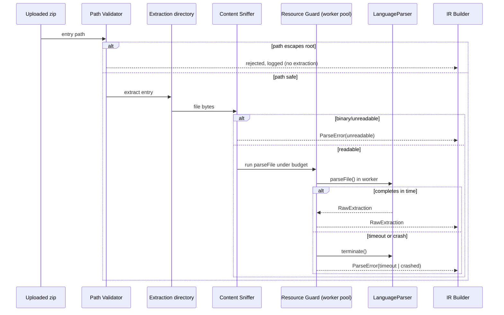

# Technical Specification: Extraction Safety & Input Hardening

**Status:** Approved for implementation
**Component:** 2 of 10 (see `cartograph_technical_spec_priorities.md`)
**Depends on:** None directly; produces `ParseError` entries consumed by the IR & Identity
Model (Component 1)
**Blocks:** Milestone 1 in full

---

# 1. Purpose

## Why this subsystem exists

The existing `safeUnzip.ts` guards aggregate limits (25MB compressed, 250MB extracted, 800
files) — real protection against zip bombs, but not against two distinct threats: a single
malicious path escaping the extraction sandbox, and a single well-within-limits file crafted to
hang or crash a parser. Both were identified as live gaps in the final architecture review, not
future risks. This subsystem closes them.

## What problem it solves

Cartograph's core differentiator is safely accepting arbitrary, untrusted uploaded code without
executing it. That promise is only as strong as its weakest input-handling path. This
subsystem is what makes "safe by construction" true under adversarial input, not just
well-behaved input.

## Responsibilities

- Validate every extracted file path stays within the intended extraction root (zip-slip /
  path traversal protection).
- Enforce a per-file resource budget during parsing, independent of aggregate repo-level
  limits.
- Detect binary or corrupted content before it reaches a parser expecting source text.
- Provide one uniform safety envelope every parser's `parseFile` call runs inside, so no
  individual language parser has to reimplement protection.
- Emit structured, categorized failure signals that map directly onto the IR's
  `ParseError.reason` union.

## Intentionally out of scope

- Aggregate zip-level limits — already implemented in `safeUnzip.ts`; this subsystem extends
  it with path validation, not replaces the size/count ceilings.
- Language-specific parsing logic — each `LanguageParser`'s responsibility.
- IR schema validation — a separate, already-specified concern.
- Malware/virus scanning unrelated to parsing safety — out of scope per the static-analysis
  philosophy; this subsystem protects the analysis pipeline, not the user's filesystem at
  large.
- Network-based threats — not applicable; no network calls are made against uploaded content.

---

# 2. Design Goals

**Functional goals**
- Every extracted path is validated before any filesystem write.
- Every parse operation runs under an enforced, bounded resource budget.
- Safety violations produce structured, categorized signals — never silent failures, never
  process crashes.

**Non-functional goals**
- Negligible overhead on well-formed input (the common case).
- Bounded worst-case behavior regardless of adversarial input.
- Deterministic: the same adversarial input is rejected the same way on every run.

**Design principles**
- Defense in depth — validate at extraction time *and* at parse time; don't rely on one layer.
- Fail closed — ambiguity is rejected, not accommodated.
- Isolate failures to the smallest unit possible — one file's rejection never aborts the whole
  analysis, consistent with the IR's per-file failure isolation.

**Constraints inherited from Cartograph's philosophy**
- No code execution — this subsystem is where that boundary is concretely enforced: bytes are
  read and statically analyzed, never executed or interpreted as a program. No symlink
  following that could reach executable paths; no auto-extraction of nested archives beyond
  existing limits.

---

# 3. Architecture

## Internal components

- **Path Containment Validator** — confirms every extracted entry's resolved path stays
  within the extraction root.
- **Per-File Resource Guard** — wraps a parser's `parseFile` call in a worker-thread-backed,
  genuinely enforceable time budget.
- **Content Sniffer** — fast binary/encoding check before a parser receives file bytes.
- **Safety Event Log** — structured record of every rejection or degradation, feeding future
  observability work (Milestone 10).

## Data flow

1. Zip bytes arrive at `safeUnzip`.
2. Per zip entry, the Path Containment Validator checks the resolved output path; failing
   entries are dropped and logged, never extracted.
3. Aggregate limits are checked incrementally as entries stream in (existing behavior,
   referenced not redesigned) — extraction aborts mid-stream once a running total crosses a
   limit, not after full decompression.
4. Before a parser processes an extracted file, the Content Sniffer checks a bounded byte
   sample; failing files become a `ParseError{reason:'unreadable'}` without invoking the
   parser.
5. Parser invocation runs inside the Per-File Resource Guard with a time budget (default
   5000ms) and a line-length ceiling.
6. On timeout or crash, the guard aborts the worker and produces a `ParseError` with the
   appropriate reason — never lets the failure propagate as an exception.
7. All outcomes flow into IR construction exactly as already specified — this subsystem
   produces `ParseError` entries and gates parsing; it does not modify the IR schema.

## Sequence diagram



## State transitions

Each file moves through: `Extracted → ContentChecked → {Parsing → Completed | TimedOut |
Crashed} | Rejected(unreadable)`. Every terminal state except `Completed` produces a
`ParseError`; none produce a thrown exception or a missing node.

---

# 4. Public Interfaces

```typescript
// ---- Path containment ----

interface PathValidationResult {
  safe: boolean;
  resolvedPath?: string;   // present when safe
  reason?: 'traversal' | 'symlink-escape' | 'absolute-path' | 'path-too-long';
}

function validateExtractionPath(
  entryPath: string,
  extractionRoot: string
): PathValidationResult;

// ---- Content sniffing ----

interface ContentSniffResult {
  readable: boolean;
  reason?: 'binary' | 'invalid-encoding' | 'empty';
}

/** Operates on a bounded sample (first 8KB), not the full file. */
function sniffContent(buffer: Buffer): ContentSniffResult;

// ---- Per-file resource guard ----

interface ResourceBudget {
  timeoutMs: number;            // default 5000
  maxLineLength: number;         // default 200_000 chars
  maxFileSizeBytes: number;      // per-file ceiling, independent of aggregate zip limits
}

interface GuardedParseResult<T> {
  outcome: 'completed' | 'timeout' | 'oversized' | 'crashed';
  value?: T;            // present only when outcome === 'completed'
  errorDetail?: string;  // present for 'crashed'
}

/** Wraps any parser's parseFile call. Never throws. */
function runWithResourceGuard<T>(
  fn: () => Promise<T>,
  budget: ResourceBudget
): Promise<GuardedParseResult<T>>;

// ---- Safety event (observability) ----

interface SafetyEvent {
  type: 'path-rejected' | 'content-unreadable' | 'resource-exceeded';
  path: string;
  detail: string;
  timestamp: string;
}

interface SafetyEventLog {
  record(event: SafetyEvent): void;
  drain(): SafetyEvent[];   // consumed once per analysis run, attached to run metadata
}
```

## Input/output contracts

- `validateExtractionPath` and `sniffContent` never throw; both always return a result object,
  called synchronously in the hot path.
- `runWithResourceGuard` never throws; timeout and crash outcomes are captured as data
  (`GuardedParseResult`), matching the "never throw, capture as data" pattern already
  established in the IR spec.

## Error contract

**No exception crosses this subsystem's public boundary under adversarial input.** This is a
hard requirement: a thrown exception from a single adversarial file could crash the whole
serverless invocation — exactly the failure mode this component exists to prevent.

---

# 5. Internal Models

## Path containment algorithm

Resolve the entry path against the extraction root via normalize + resolve, then verify the
resolved absolute path starts with the extraction root's absolute path, checked at a path
separator boundary (to avoid a prefix false-negative like `/root2` matching `/root`). Reject
if the entry path is absolute, contains `..` segments that escape after normalization, or
resolves outside the root. **Symlink entries within the zip are rejected outright** — Cartograph
never needs symlink-following for static import analysis, so the simplest safe policy
eliminates an entire bug class rather than trying to validate "safe" symlinks.

## Content sniffing algorithm

Read a bounded initial sample (8KB), attempt UTF-8 decode, and check the null-byte / non-
printable-character ratio (standard binary-detection heuristic). O(1) relative to file size —
never scans a whole large file just to sniff it.

## Resource guard — the key technical decision

Node.js cannot preemptively terminate synchronous CPU-bound work without a worker thread. **A
naive `Promise.race` against a timer does not stop a runaway synchronous parse** — the CPU-bound
work keeps blocking the event loop even after the timeout promise "wins" the race. This is the
single most important implementation detail in this component: getting it wrong silently fails
to protect against the exact threat the component exists to stop.

The guard runs each file's parse inside a `worker_threads` pool (sized to available CPU cores,
capped at a sane maximum for serverless environments where reported core count may not reflect
real allocation). On timeout, `worker.terminate()` is called — a real, OS-enforced termination,
not a promise that simply stops being awaited.

## Complexity

| Operation | Complexity |
|---|---|
| Path validation | O(path length) |
| Content sniffing | O(1) relative to file size (bounded sample) |
| Resource guard overhead | Worker communication cost + actual parse time |

---

# 6. Edge Cases

1. **Zip entry with `../../etc/passwd`-style path.** Rejected by the Path Containment
   Validator; never extracted; logged as `path-rejected`.
2. **Absolute path entry** (`/etc/passwd`). Rejected — absolute paths are never valid within
   an extraction root.
3. **Symlink entry pointing outside the extraction root.** Rejected outright — no symlinks are
   extracted at all, by policy.
4. **Extreme path depth** (hundreds of nested folders, within size/count limits). Capped by a
   path-length ceiling (4096 chars); entries exceeding it are rejected.
5. **A small file with one extremely long line** (minified/obfuscated source). Caught by
   `maxLineLength`, independent of total file size — two independent catches apply here
   (pre-check where feasible, guard timeout as the general-purpose fallback).
6. **Deeply nested bracket structures crafted to cause parser stack overflow.** The timeout-
   based worker guard is the general-purpose catch-all, since detecting "will this overflow the
   stack" statically isn't feasible across arbitrary grammars. A worker crash (including a
   native stack overflow) must be caught via the worker's exit/error event, not just its
   resolved value, and reported as `outcome: 'crashed'` — never allowed to crash the parent
   process.
7. **A file with source-code extension but binary content** (renamed image file). Caught by
   content sniffing before parser invocation, `reason: 'binary'`.
8. **Single highly-compressed entry expanding enormously.** Already covered by the existing
   aggregate extracted-size limit — confirmed here to be checked incrementally during
   decompression, aborting mid-stream, not decompress-then-check.
9. **Duplicate zip entries** (same path twice in one zip — a known ambiguity across zip
   tooling). Policy: last-entry-wins, explicitly decided and documented rather than left to an
   underlying library's default.
10. **Worker pool exhaustion under legitimate load** (e.g. 800 files queued against a small
    pool). Must degrade to queuing — never fall back to unguarded synchronous parsing just
    because the pool is busy.
11. **Valid UTF-8 containing unusual control characters or obfuscation-style Unicode**
    (zero-width characters). Flagged as a lower-severity note (`reason: 'unknown'`), not fully
    rejected — safe display is the UI's responsibility (escaping on render), not this
    subsystem's.

---

# 7. Failure Handling

- **Error recovery.** Every rejection becomes structured data — a `SafetyEvent` and eventually
  a `ParseError` on the affected file — never a thrown exception.
- **Graceful degradation.** Files caught by content sniffing or the resource guard still
  produce a `FileNode` (per the IR spec) — visible in the graph as "exists but couldn't be
  safely analyzed," never silently missing.
- **Timeouts.** The core mechanism of this component — explicit, worker-based, genuinely
  enforced, not a best-effort race.
- **Invalid input.** Handled by two independent gates (extraction-time path check, pre-parse
  content sniff) — deliberately redundant, not a single point of failure.
- **Partial failures.** If the worker pool or process is interrupted mid-run, this component
  introduces no second persistence path — it only produces inputs to IR construction, which
  owns the sole all-or-nothing storage guarantee.

---

# 8. Performance

- **Complexity:** path validation and content sniffing are O(1) relative to file size; guard
  overhead is dominated by worker communication, small relative to actual parse time for
  typical source files.
- **Memory:** worker pool size trades memory (each worker has its own heap) against
  parallelism — size to available CPU cores, capped for serverless environments.
- **Scalability:** overhead scales linearly with file count; the pool bounds peak concurrency,
  preventing resource exhaustion from very wide repos even before per-file limits engage.
- **Expected bottlenecks:** worker spawn/teardown cost if workers are created per-file instead
  of pooled — explicitly design for a long-lived pool.
- **Future optimizations:** adaptive timeout budgets that scale down as file count rises, to
  keep total analysis time bounded — not needed at the current 800-file ceiling.

---

# 9. Security

- **Threat model.** An untrusted zip crafted to (a) escape the extraction sandbox via path
  traversal, or (b) cause denial-of-service against the analysis service via a single
  pathological file — distinct from the already-covered aggregate zip-bomb case.
- **Abuse cases.** Path traversal via `../`, absolute paths, symlinks; algorithmic-complexity
  attacks targeting a specific parser's worst-case behavior; single-entry decompression bombs.
- **Validation.** Every path validated before filesystem write; every file's content sniffed
  before parser invocation; every parse invocation resource-bounded regardless of which
  language's parser is running. This uniformity is what lets a future language (Go, Java,
  C++) be added without auditing each new parser individually for DoS resistance — the guard
  applies the same way to all of them.
- **Defensive programming.** Fail closed on ambiguity. Never trust a parser library's own
  internal safety claims — the external guard is the actual enforcement mechanism regardless
  of what any individual parser does internally.

---

# 10. Testing Strategy

- **Unit tests:** path validation against a comprehensive traversal-pattern set (`../`,
  absolute paths, symlinks, mixed separators); content sniffing against known binary/text
  fixtures.
- **Integration tests:** the full extraction + guard pipeline against fixture zips containing
  deliberately adversarial entries.
- **Conformance tests:** every `LanguageParser` implementation runs through this guard as part
  of the Conformance Test Framework's fixture suite, confirming no false positives against
  well-formed real-world files.
- **Performance tests:** worker pool throughput at the 800-file ceiling; guarded-vs-unguarded
  overhead measurement to confirm the guard's cost stays negligible for well-formed input.
- **Failure tests:** one explicit test per edge case in Section 6 — 11 tests minimum.
- **Property-based tests:** *For any byte sequence claiming to be a zip entry path,
  `validateExtractionPath` either returns a path that is a true descendant of
  `extractionRoot`, or returns `safe: false` — never anything in between.* Path-string fuzzing
  is exactly the kind of input space where ad hoc examples miss cases (mixed separators,
  encoded traversal sequences) that generative testing catches reliably.

---

# 11. Implementation Plan

**PR 1 — Path Containment Validator**
- *Objective:* Implement `validateExtractionPath` with symlink/absolute/traversal rejection.
- *Files:* `lib/safety/pathValidation.ts` (new), `safeUnzip.ts` (wired in).
- *Risks:* Platform-specific separator handling — mitigate by normalizing early and testing
  against both POSIX and Windows-style separators regardless of deployment target.
- *Validation:* Unit tests plus the property-based fuzz test from Section 10.
- *DoD:* All constructed zip-slip fixtures rejected; existing well-formed fixture zips extract
  unchanged.

**PR 2 — Content Sniffer**
- *Objective:* Implement `sniffContent`, wired in before parser invocation.
- *Files:* `lib/safety/contentSniff.ts` (new), extraction orchestration (wired in).
- *Risks:* False positives on legitimate but unusual encodings (UTF-8 with BOM, etc.) —
  mitigate with a real-world fixture sample covering common legitimate cases, not only failure
  cases.
- *Validation:* Unit tests against a binary/text fixture set.
- *DoD:* Zero false positives across 50+ real open-source source files spanning languages.

**PR 3 — Per-File Resource Guard (worker-based)**
- *Objective:* Implement `runWithResourceGuard` on a `worker_threads` pool with real
  termination on timeout.
- *Files:* `lib/safety/resourceGuard.ts` (new), `lib/safety/workerPool.ts` (new).
- *Risks:* Highest-complexity PR in this spec — getting termination semantics wrong (e.g.
  falling back to `Promise.race`) silently defeats the component's purpose. Mitigate with an
  explicit test constructing a genuinely runaway synchronous computation and confirming
  wall-clock termination.
- *Validation:* The runaway-computation test above; worker pool throughput benchmark.
- *DoD:* A deliberately infinite-loop fixture is terminated within budget plus a small margin,
  confirmed by wall-clock measurement, not by observing promise settlement.

**PR 4 — Safety Event Log and IR wiring**
- *Objective:* Implement `SafetyEventLog`; ensure every rejection/timeout/binary-content event
  produces a `ParseError` consumable by the IR Builder, using the shared reason-code type from
  Component 1, not an independently-maintained string union.
- *Files:* `lib/safety/eventLog.ts` (new), extraction orchestration integration point.
- *Risks:* Reason-code mismatch between this component and the IR spec's expectations —
  mitigated by importing the shared type rather than redefining it.
- *Validation:* Integration test confirming a rejected file appears in the final
  `RepositoryIR` as a `FileNode` with the correct `ParseError`, not as a silently missing file.
- *DoD:* End-to-end test from adversarial zip input through to a queryable IR node with
  correct provenance.

**PR 5 — Wire into the existing pipeline**
- *Objective:* Replace the current `safeUnzip`-only protection with the full hardened
  pipeline, zero regression for well-formed repos.
- *Files:* `analyzeRepository.ts`, `safeUnzip.ts`.
- *Risks:* Performance regression from added guard overhead on the happy path — benchmark
  before/after.
- *Validation:* Full existing test suite plus the new adversarial fixture suite; performance
  benchmark comparison.
- *DoD:* Existing functionality unchanged for well-formed input; all adversarial fixtures
  handled safely; guard overhead within an acceptable margin (target: <10% added to
  well-formed-input analysis time).

---

# 12. Future Extensions

- **Per-language budget tuning** — `ResourceBudget` already supports per-call overrides if a
  future language's parser genuinely needs a different default.
- **Feeds the Milestone 10 observability dashboard** — the Safety Event Log is a natural data
  source for the "provenance mix as a trust metric" work; requires no redesign here, only a
  consumer later.
- **Adaptive timeout scaling** (Section 8) becomes relevant only if the file-count ceiling is
  raised significantly.

---

# 13. Design Review

## Weaknesses

- Worker-based termination adds real operational complexity (process management, IPC
  overhead) compared to a naive timeout — deliberately accepted because the simpler approach
  does not actually work for its stated purpose. Worth flagging as this component's biggest
  implementation complexity relative to its conceptual simplicity.
- Content sniffing operates on a bounded 8KB sample — a file valid for its sample but corrupted
  later wouldn't be caught until the parser itself fails on it. Acceptable: it's still caught,
  just slightly later, as a fatal `ParseError`, not a gap that causes unsafe behavior.
- The path-length and line-length caps (4096 chars, 200,000 chars) are reasonable starting
  numbers, not derived from rigorous analysis — flagged for recalibration once real
  benchmark data exists (Component 3, Performance & Benchmarking Framework).

## Trade-offs

- **Reject all symlinks outright** rather than validating and allowing safe ones. Small chance
  of rejecting a rare, legitimate use; in exchange, eliminates an entire traversal bug class.
  Cartograph doesn't need symlink-following for static import analysis, making this an easy
  call, not a difficult one.
- **Worker-thread pool over process/container-level sandboxing.** Weaker isolation than a full
  process boundary (a worker thread shares the parent's memory space) in exchange for far
  lower overhead and simpler deployment within the existing serverless model. Accepted given
  that "static analysis only, no execution" already limits what code ever runs against
  uploaded content — well-audited parser libraries, never the uploaded code itself.
- **Two independent, redundant checks** (content sniff and resource guard) covering overlapping
  threat classes, rather than one. Deliberate defense-in-depth trade-off — more implementation
  surface, meaningfully better coverage, justified because this is the one component where a
  missed check has security consequences rather than a correctness bug.

## Alternatives considered

- **Relying solely on existing aggregate `safeUnzip` limits**, skipping per-file budgets
  entirely. Rejected: aggregate limits provably don't catch the adversarial-single-file class —
  a small, deeply-nested file passes every aggregate check and can still hang a parser.
- **`Promise.race`-based timeout** instead of worker threads. Rejected per Section 5: it
  doesn't actually stop synchronous CPU-bound work from blocking the process.
- **Full process- or container-level sandboxing per file.** Rejected as disproportionate given
  the threat model — "static analysis only" already constrains what's running. Worth
  revisiting only if a future language's parser genuinely requires executing untrusted code to
  analyze it, which would itself violate the core philosophy and should be rejected on those
  grounds first.

## Why this design was chosen

It closes the two concrete gaps identified in the final architecture review — zip-slip and
adversarial per-file input — with the minimum machinery that actually works: worker threads
specifically because the alternative doesn't provide a real guarantee, defense-in-depth
specifically because this is a security-relevant component where a single missed check has
consequences beyond a correctness bug.

## Intentionally deferred

Process/container-level sandboxing (revisit only if the threat model changes); adaptive or
per-language budget tuning (revisit once real usage data exists); extending the Safety Event
Log into a full observability dashboard (a Milestone 10 concern — this component only needs to
produce the right data shape now).
