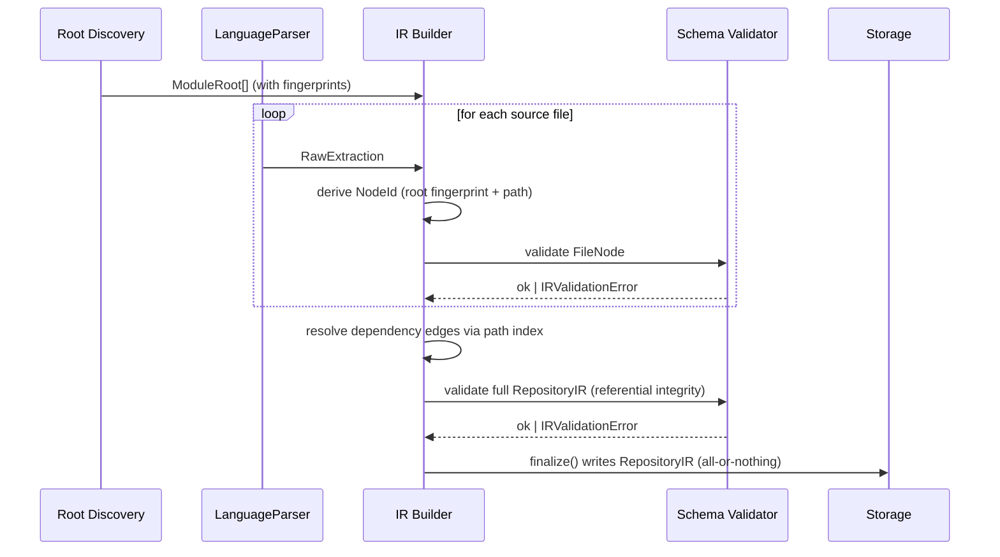

# Technical Specification: IR & Identity Model

**Status:** Approved for implementation
**Component:** 1 of 10 (see `cartograph_technical_spec_priorities.md`)
**Depends on:** None — this is the foundational layer
**Blocks:** Milestone 1 in full; every subsequent component in the roadmap

---

# 1. Purpose

## Why this subsystem exists

Every parser, analyzer, the Architecture Model, the Query Engine, and eventually the AI layer
read or write one shared representation of "what a codebase looks like." This subsystem
defines that representation. It is the single point where the many-languages-in, many-views-out
architecture becomes possible — without it, every downstream component would need per-language
logic, defeating the entire plugin model.

## What problem it solves

Without a common IR, adding a language means adding N bespoke consumers, not one parser plugin.
This subsystem decouples "how do I extract facts from source" (parser concern) from "what do
facts mean architecturally" (everything downstream), and gives every fact a queryable answer to
"how sure are we about this."

## Responsibilities

- Define stable, deterministic node and edge identity.
- Define two structurally distinct edge types — containment (hierarchy) and dependency
  (imports) — that must never be merged.
- Carry provenance on every fact-bearing structure.
- Define capability flags so parsers can honestly declare what they did and didn't extract.
- Define schema versioning (`irVersion`) and an additive-only compatibility policy.

## Intentionally out of scope

- Full ASTs or token-level representation — facts only, not parse trees.
- Type information or symbol resolution beyond a future, separately-scoped tier-2
  (declaration name + kind, no type inference).
- Call graphs or control-flow graphs.
- Raw source text or comments — position references only; consumers fetch source on demand.
- Storage backend implementation (blob vs. indexed store) — this defines the schema of what's
  stored, not where.
- Query/traversal algorithms — that's the Query Engine's responsibility, built on top of this.
- Any heuristic or inferred architectural concept (layers, domains, services) — those live in
  the Architecture Model, referencing this schema's node IDs, never inside it.

---

# 2. Design Goals

**Functional goals**
- One canonical schema represents a file in any supported language.
- A parser with partial capabilities still produces a valid IR — no all-or-nothing extraction.
- Multi-root, mixed-language repositories are representable without special-casing.
- The IR is diffable/comparable across runs, to support determinism testing.

**Non-functional goals**
- Deterministic: identical input → identical IR, with time-varying fields (timestamps)
  isolated into their own metadata block, never embedded per-node.
- Compact: no raw source content in storage.
- Forward-compatible: new optional fields addable without breaking old consumers or old
  stored data.
- Construction overhead must not bottleneck analysis of the largest supported repo
  (800 files / 250MB, per the existing safety ceiling).

**Design principles**
- Additive-only schema evolution within a major `irVersion`.
- Provenance is mandatory on every fact-bearing structure, not optional.
- Identity is explicitly designed, never implicit (no `filePath`-as-ID).
- Containment and dependency are structurally separate types, enforced by the type system.

**Constraints inherited from Cartograph's philosophy**
- Static analysis only — no schema field that can only be populated by executing code.
- Every fact must be traceable to a deterministic computation; confidence is a queryable
  property, never an implicit assumption.
- No language-specific fields in the shared schema — language-specific state stays inside the
  parser, never leaks into the canonical IR.

---

# 3. Architecture

## Internal components

- **IR Type Definitions** — pure types, no logic; the schema itself.
- **Identity Service** — pure functions deriving stable IDs from `(rootFingerprint, relativePath)`.
- **IR Builder** — assembles validated IR structures from a parser's raw output, assigns
  identity, stamps provenance.
- **Schema Validator** — runtime validation (e.g. zod) that every constructed structure
  conforms to the current `irVersion` schema before proceeding downstream.
- **Path Index** — a `Map<path, NodeId>` built once per analysis run, used by every parser
  during import resolution to avoid quadratic lookups.

## Data flow

1. Root discovery produces `ModuleRoot[]` with fingerprints (upstream of this subsystem,
   consumed here).
2. For each file, a `LanguageParser` produces a `RawExtraction` (parser-internal, not yet
   canonical).
3. IR Builder converts `RawExtraction` + owning root → `FileNode`, containment edge, stamps
   provenance and `irVersion`.
4. Schema Validator checks each constructed node before it's merged into the repository-wide
   `RepositoryIR`.
5. Dependency edges are resolved via the Path Index once all files are known.
6. `finalize()` performs a full referential-integrity pass and produces the immutable
   `RepositoryIR` — the only object ever persisted to storage.

## Sequence diagram



## State transitions

Not a traditional state machine, but one propagation rule governs the whole system and must be
enforced structurally, not just documented:

> A fact's provenance is only ever `verified` or `derived` if every input it was computed from
> is also `verified` or `derived`. The moment any upstream input is `heuristic`, the output is
> `heuristic` too — permanently, for that fact. Provenance never silently upgrades.

---

# 4. Public Interfaces

```typescript
// ---- Identity ----

/** Opaque, stable identifier. Always derived deterministically; never random. */
type NodeId = string & { readonly __brand: 'NodeId' };
type EdgeId = string & { readonly __brand: 'EdgeId' };

type LanguageId = 'typescript' | 'javascript' | 'python'; // extended additively per language

/** A discovered root governing a subtree (go.mod, package.json, pyproject.toml, etc.) */
interface ModuleRoot {
  id: NodeId;
  kind: 'ModuleRoot';
  rootPath: string;        // relative to repo root
  language: LanguageId;
  manifestFile: string;    // e.g. "go.mod", "package.json"
  fingerprint: string;     // stable hash used in ID derivation — see Section 5
}

// ---- Provenance ----

type ProvenanceOrigin =
  | 'verified'           // directly observed static fact
  | 'derived'             // deterministic computation over verified/derived facts only
  | 'heuristic'           // best-effort inference; may be wrong
  | 'user-defined'        // explicit user configuration/override
  | 'ai-interpretation';  // natural-language explanation; never a graph fact

interface Provenance {
  origin: ProvenanceOrigin;
  /** Present only for 'derived' or 'heuristic': what this was computed from. */
  derivedFrom?: (NodeId | EdgeId)[];
  /** Free text only for 'heuristic' or 'ai-interpretation'; omitted otherwise. */
  note?: string;
}

// ---- Capabilities ----

/** Minimal set at launch. Extended additively — see Section 12. */
type ParserCapability = 'imports' | 'exports';

// ---- Nodes ----

type NodeKind = 'File' | 'ModuleRoot' | 'ExternalDependency';

interface FileNode {
  id: NodeId;
  kind: 'File';
  path: string;                       // relative to repo root
  language: LanguageId;
  lineCount: number;
  ownerRootId: NodeId;                // containment: which ModuleRoot this file belongs to
  confidence: 'precise' | 'heuristic';
  parseErrors: ParseError[];
  capabilitiesUsed: ParserCapability[];
  provenance: Provenance;
}

interface ExternalDependencyNode {
  id: NodeId;
  kind: 'ExternalDependency';
  name: string;                       // raw package/module name as referenced in source
  language: LanguageId;
  provenance: Provenance;
}

type IRNode = FileNode | ModuleRoot | ExternalDependencyNode;

// ---- Edges ----

type EdgeKind = 'contains' | 'imports';

interface Edge {
  id: EdgeId;
  kind: EdgeKind;
  from: NodeId;
  to: NodeId;
  provenance: Provenance;
}

// ---- Parse errors ----

interface ParseError {
  message: string;
  line?: number;
  column?: number;
  /** 'fatal': file's facts could not be extracted. 'partial': some data was salvaged. */
  severity: 'fatal' | 'partial';
  /** Distinguishes pathological-input timeouts from genuine syntax errors. */
  reason: 'syntax' | 'timeout' | 'unreadable' | 'unknown';
}

// ---- Top-level container ----

interface RepositoryIR {
  irVersion: 1;
  generatedAt: string;    // ISO timestamp — isolated metadata, not per-node
  nodes: IRNode[];
  edges: Edge[];
  roots: ModuleRoot[];
}

// ---- Parser-facing contract ----

/** What every LanguageParser implementation returns per file. */
interface RawExtraction {
  path: string;
  lineCount: number;
  internalImports: string[];   // raw specifiers, not yet resolved to NodeId
  externalImports: string[];
  parseErrors: ParseError[];
  capabilitiesUsed: ParserCapability[];
}

interface ResolvedImport {
  targetId: NodeId;    // resolved FileNode or ExternalDependencyNode id
  raw: string;          // original specifier, retained for diagnostics
}

// ---- Builder contract ----

interface IRBuilder {
  buildFileNode(raw: RawExtraction, ownerRoot: ModuleRoot): FileNode;
  buildContainmentEdge(file: FileNode, root: ModuleRoot): Edge;
  buildDependencyEdges(file: FileNode, resolved: ResolvedImport[]): Edge[];
  /** Only path to storage. Performs full referential-integrity validation. Never partial. */
  finalize(nodes: IRNode[], edges: Edge[], roots: ModuleRoot[]): RepositoryIR;
}
```

## Input/output contracts

- `buildFileNode` never throws. Invalid or partial extraction becomes a `FileNode` with
  `parseErrors` populated and `confidence: 'heuristic'` — or the file is still represented even
  on fatal failure (see Section 6).
- `finalize` throws `IRValidationError` on schema or referential-integrity violation. This
  represents a builder or parser bug, not a data-quality issue, and should never occur against
  well-formed input in production.

## Error contract

- `IRValidationError` — includes structured validation issues for debugging. Indicates an
  internal bug, not user input. Never expected in steady-state production use.
- Parser-level failures are data (`ParseError`), never exceptions — a single file's failure
  must never abort the whole repository's analysis. This mirrors the existing
  `ts.transpileModule` diagnostics-over-throw pattern already in the codebase.

---

# 5. Internal Models

## Identity derivation

```
rootFingerprint = hash(root.rootPath + ':' + root.manifestFile)
nodeId(file)    = hash(rootFingerprint + ':' + file.relativePathWithinRoot)
```

Hash function: SHA-256, truncated to 128 bits, base62-encoded for compactness. This is a
committed decision, not a placeholder — changing it later changes every ID in every stored
analysis.

**Scope of the determinism guarantee, stated precisely:** this scheme guarantees that the same
zip, analyzed twice, produces byte-identical IDs (the property required by the "same input, same
output" principle). It does **not** guarantee that a file's ID survives a rename between two
different uploads of "the same" project over time — see Section 13 for why that's an
intentionally deferred, separate problem.

## Path Index

A `Map<relativePath, NodeId>`, built once per analysis run after all `FileNode`s exist, before
dependency-edge resolution begins. Every parser's import resolution reads from this shared
index rather than scanning the file list per import — this is the specific mechanism that
keeps resolution linear instead of quadratic, and it must be built exactly once, not
reconstructed per file.

## Algorithms and complexity

| Operation | Complexity | Notes |
|---|---|---|
| ID derivation | O(1) per node | O(N) total for N files |
| Path Index construction | O(N) | One pass after all FileNodes exist |
| Dependency edge resolution | O(N + E) | E = total import statements, given the prebuilt index |
| Schema validation (per-node) | O(1) per node | O(N) total |
| Referential integrity check (finalize) | O(N + E) | Set-based lookup, not repeated array scans |
| **Overall IR construction** | **O(N + E)** | Well within budget at the 800-file/250MB ceiling |

## Caches

None at this layer. IR construction is a single pass per analysis run; caching becomes
relevant at the Query Engine layer, which is explicitly out of scope here.

---

# 6. Edge Cases

1. **File with no imports and no exports.** Still produces a valid `FileNode` with empty edge
   lists — never excluded for being "uninteresting."
2. **File that fails to parse entirely.** `FileNode` is still created (so the file remains
   visible in the graph). `parseErrors` gets a `severity: 'fatal'` entry; `confidence:
   'heuristic'` if anything was salvaged, otherwise empty import lists with the fatal flag.
   Silently dropping the node would misrepresent the repo's true file count.
3. **Unresolvable import** (typo, build-tool-generated path, or genuinely external but
   undeclared). Represented as an `ExternalDependencyNode` with a `heuristic` provenance note —
   never silently discarded.
4. **Path collision across roots** (`src/index.ts` under two different roots in a monorepo).
   Cannot collide by construction, since `NodeId` incorporates `rootFingerprint`, not just
   path. Explicit test required.
5. **Circular containment.** Shouldn't be structurally possible given top-down root discovery,
   but the Schema Validator asserts no containment cycles as a safety net regardless.
6. **Self-import** (a file importing itself, seen in some circular re-export patterns).
   Allowed; represented as a self-loop edge. Flagging it as an anomaly is the Analyzer
   Framework's job, not this layer's.
7. **Empty repository.** A `RepositoryIR` with empty `nodes`/`edges` is valid, not an error.
8. **A file matching multiple parsers' extensions.** Should not happen if the Parser Registry
   partitions extensions correctly; if it does, `finalize` throws `IRValidationError` loudly —
   this represents a registry configuration bug, not a data-quality issue.
9. **Deeply nested relative imports** (`from ....... import x`). Resolution is capped at a
   fixed depth; anything beyond it becomes an unresolved reference with a `heuristic`
   provenance note, never unbounded recursion.
10. **Corrupted or non-UTF8 file matched by extension.** Treated as a fatal parse error with
    `reason: 'unreadable'`, caught by the per-file safety budget defined in the Extraction
    Safety spec (cross-referenced, not re-designed here).
11. **Nested module roots** (a valid nested Go module, or similar). Both become distinct
    `ModuleRoot` nodes; a containment edge connects the roots themselves.

---

# 7. Failure Handling

- **Error recovery.** Per-file failures never abort the run. Each file is processed
  independently; failures are isolated to that file's node.
- **Graceful degradation.** A parser lacking a capability, or hitting a file it can't fully
  process, still contributes what it has rather than excluding the file — paired with
  confidence tagging so downstream consumers know to treat it cautiously.
- **Timeouts.** Governed by the per-file resource budget defined in the Extraction Safety
  spec. On timeout, the builder receives a specific signal and produces a `ParseError` with
  `reason: 'timeout'`, distinct from a generic failure — this distinction matters for
  diagnosing whether slowness is pathological input or genuine complexity.
- **Invalid input.** A malformed `RawExtraction` (e.g. a buggy parser omitting a required
  field) is caught by the Schema Validator. In development this fails loudly
  (`IRValidationError`) to surface parser bugs immediately. In production it degrades to
  excluding only that one file's node with a logged internal error — one buggy parser output
  must never fail the entire repository's analysis.
- **Partial failures.** `finalize()` is the only path allowed to write to storage, and it
  performs full validation first. There is no incremental or streaming write of an unfinished
  `RepositoryIR` — if the process is interrupted mid-construction, nothing partial is ever
  persisted. Failing the whole analysis is strictly preferable to storing an incomplete graph
  that looks complete.

---

# 8. Performance

- **Complexity:** O(N + E), dominated by Path Index construction and edge resolution.
- **Memory:** The full `RepositoryIR` is held in memory during construction. For 800 files with
  typical import counts, this is low tens of MB — small relative to the AST-in-memory concern
  already flagged for the TS Compiler API, which is a parser-internal issue this IR schema
  actually mitigates in the long run, by stripping ASTs down to minimal facts before anything
  is retained.
- **Scalability:** Linear in file and import count. The real bottleneck risk lives inside
  individual parsers (AST retention), not IR construction itself.
- **Expected bottlenecks:** Path Index construction at the upper file-count ceiling — should be
  benchmarked at 800 files via the Performance & Benchmarking Framework before this component
  is considered validated at scale.
- **Future optimizations:** Streaming/incremental construction (processing and indexing files
  as they're parsed, rather than holding all `RawExtraction`s before building) — not needed at
  current scale, worth revisiting only if the file-count ceiling is raised substantially.

---

# 9. Security

- **Threat model.** This subsystem doesn't execute anything, but it's the structure into which
  potentially adversarial file content flows — via import specifier strings, paths, and error
  messages extracted from an untrusted upload.
- **Abuse cases.** A maliciously long import specifier or path (memory/storage bloat), or one
  containing control characters or script-like content that could cause a stored-XSS risk if
  ever rendered unescaped in the UI later.
- **Validation.** Every `RawExtraction` is schema-validated before becoming part of the
  canonical IR — no raw parser output is trusted implicitly. String fields (`path`, import
  specifiers) are length-capped; anything exceeding a sane bound is converted to a
  `ParseError` rather than stored verbatim.
- **Defensive programming.** `NodeId` generation must not let attacker-controlled path content
  cause a collision that matters — a 128-bit truncated hash makes accidental collision
  practically impossible. This is a correctness control, not a security boundary: paths are
  attacker-influenceable within an uploaded zip, but a hypothetical collision would corrupt the
  graph, not grant any privilege.

---

# 10. Testing Strategy

- **Unit tests:** ID derivation determinism (same input → same ID, across repeated calls and
  process restarts); provenance propagation rule (`heuristic` input → `heuristic` output,
  enforced, not just documented); Schema Validator accepts valid / rejects invalid shapes for
  every type in Section 4.
- **Integration tests:** Full `RawExtraction[]` → `RepositoryIR` construction against
  representative fixture repos (single-root, multi-root, and — once Python exists —
  mixed-language).
- **Conformance tests:** Shared with the Conformance Test Framework. Every parser's
  `RawExtraction` output must successfully build into a valid `RepositoryIR` through this
  layer; this is the primary way parser bugs get caught before merge.
- **Performance tests:** Construction time and memory at the 800-file/250MB ceiling, run
  through the Performance & Benchmarking Framework.
- **Failure tests:** One explicit test per edge case in Section 6 — 11 tests minimum.
- **Property-based tests:** *For any valid set of `RawExtraction`s, `buildFileNode` +
  `finalize` never throws, and every edge's `from`/`to` id exists in the resulting `nodes`
  array.* Referential integrity is a core correctness property and is well suited to
  property-based generation (e.g. via `fast-check`) rather than enumerated examples alone.

---

# 11. Implementation Plan

**PR 1 — Core type definitions**
- *Objective:* Land the TypeScript types from Section 4 with no logic.
- *Files:* new `lib/analysis/ir/types.ts`.
- *Risks:* Getting the shape wrong before any real parser exists — mitigate by cross-checking
  against the existing `SourceFileAnalysis` type for capability parity.
- *Validation:* Type-checks compile; no runtime behavior yet.
- *DoD:* Types documented with JSDoc; reviewed against this spec.

**PR 2 — Identity Service**
- *Objective:* Implement deterministic `NodeId`/root-fingerprint derivation.
- *Files:* `lib/analysis/ir/identity.ts`.
- *Risks:* Hash choice affects long-term ID stability — committed now, documented, not
  revisited casually later.
- *Validation:* Unit tests for determinism, uniqueness across differing roots/paths.
- *DoD:* Full branch coverage; hash choice documented in code comments.

**PR 3 — Schema Validator**
- *Objective:* Runtime validation mirroring the TS types (e.g. zod schemas).
- *Files:* `lib/analysis/ir/validation.ts`.
- *Risks:* Validator drifting out of sync with types over time — mitigate with a round-trip
  test through both the type system and the validator.
- *Validation:* Valid/invalid shape tests for every type.
- *DoD:* Validator covers every field defined in PR 1.

**PR 4 — IR Builder: file nodes and containment edges**
- *Objective:* Implement `buildFileNode` and `buildContainmentEdge`, no dependency resolution
  yet.
- *Files:* `lib/analysis/ir/builder.ts`.
- *Risks:* Premature coupling to a specific parser's shape — test against a synthetic fake
  parser, not the real TS parser.
- *Validation:* Edge cases 1, 2, 7, 10 from Section 6.
- *DoD:* Builder output passes the Schema Validator for all tested cases.

**PR 5 — IR Builder: dependency resolution + Path Index**
- *Objective:* Implement the Path Index and `buildDependencyEdges`, including unresolved-import
  handling.
- *Files:* `lib/analysis/ir/builder.ts` (extended), `lib/analysis/ir/pathIndex.ts`.
- *Risks:* Accidental O(N²) resolution — explicitly benchmark against the largest fixture repo
  before merge.
- *Validation:* Edge cases 3, 4, 6, 9; performance test confirming linear scaling.
- *DoD:* Benchmark results recorded and within budget.

**PR 6 — `finalize()` and referential integrity**
- *Objective:* Implement `finalize`, the all-or-nothing storage guarantee, and full-graph
  referential integrity checking.
- *Files:* `lib/analysis/ir/builder.ts`, `lib/analysis/ir/validation.ts`.
- *Risks:* Naive integrity checking could be slow — use Set-based lookups, not repeated scans.
- *Validation:* Property-based test from Section 10; edge cases 5, 8, 11.
- *DoD:* Property-based suite integrated into CI and passing.

**PR 7 — Migrate the existing TS pipeline onto this subsystem**
- *Objective:* Replace ad hoc `SourceFileAnalysis` construction with calls through the new IR
  Builder, zero behavior change to end users.
- *Files:* `extractImports.ts` (adapted to emit `RawExtraction`), `analyzeRepository.ts`.
- *Risks:* Highest-risk PR in this sequence — a regression here affects every existing
  user-facing feature. Capture golden-file snapshots before this PR, diff after.
- *Validation:* Full existing test suite; golden-file diff (structurally equivalent, allowing
  for the new ID scheme replacing `filePath`-as-key).
- *DoD:* Zero regression in existing behavior; determinism suite green.

**PR 8 — `irVersion` stamping and storage round-trip**
- *Objective:* Stamp `irVersion: 1` on every `RepositoryIR`; confirm storage persists and
  round-trips it correctly.
- *Files:* `lib/storage/*`, `lib/analysis/ir/builder.ts`.
- *Risks:* Low — largely plumbing; full version-compatibility policy enforcement is deferred
  until a second version actually exists.
- *Validation:* Round-trip test (write, read back, deep-equal).
- *DoD:* Stored analyses include `irVersion`; documented in the storage schema.

---

# 12. Future Extensions

- **Tier-2 declarations.** `capabilitiesUsed` and the node structure accommodate an optional
  `declarations: Declaration[]` field on `FileNode` as a purely additive change — no breaking
  migration required when a real dead-code analyzer needs it.
- **Additional capability flags** (`symbolUsage`, `comments`, etc.) — `ParserCapability` is
  designed as an additive union.
- **Query Engine indexing.** The Path Index and referential-integrity guarantees built here are
  the direct foundation for `getNode`/`getNeighbors` — no IR redesign needed.
- **Architecture Model.** Consumes containment edges exactly as defined here; no IR change
  required when that milestone lands.
- **AI citation validation.** Depends on `NodeId`/`EdgeId` being stable, queryable identifiers
  — already guaranteed by this design.
- **Cross-upload drift tracking (Milestone 10, conditional).** Would require an additional,
  explicitly separate identity scheme layered on top — see Section 13.

---

# 13. Design Review

## Weaknesses

- The ID scheme guarantees determinism *within* a single analysis run but not identity
  stability across a file rename between two different uploads of "the same" project. This
  matters only if drift-tracking (Milestone 10) becomes a committed goal, at which point a
  separate content-similarity or manifest-based scheme would need to sit on top of this one.
  Deliberately not solved here — it's speculative scope for a feature not yet committed to.
- The `derivedFrom` field is a lightweight lineage pointer, not a full computation trace.
  Sufficient for enforcing "provenance never upgrades," but would need extending if deep
  provenance auditing ("show me exactly how this was derived, step by step") ever becomes a
  requirement.
- Per-node schema validation adds real, modest CPU overhead. Acceptable at current scale;
  worth revisiting only if IR construction — rather than parser-side work — becomes the actual
  bottleneck, which is unlikely.

## Trade-offs

- **Hash-based IDs over counters or random UUIDs**, specifically to satisfy determinism. The
  cost is that IDs are opaque and not human-readable — mitigated by always retaining the raw
  `path` on the node itself, so no one needs to manually decode an ID for debugging.
- **Always create a `FileNode`, even on fatal parse failure**, rather than excluding the file.
  The cost is that every downstream consumer must check `parseErrors`/`confidence` instead of
  assuming full population. Chosen because silently excluding a file misrepresents repo
  completeness — a worse failure mode for a trust-focused product than requiring a confidence
  check.
- **Tier-2 declarations left out of v1 entirely**, rather than stubbed in now. The cost is a
  future additive migration; the alternative — guessing the shape before any real consumer
  exists — risks locking in the wrong shape.

## Alternatives considered

- **A single untyped edge list with a string `type` field**, instead of a `kind` discriminant
  splitting `contains`/`imports`. Rejected: a string field makes the containment/dependency
  separation easy to violate accidentally; a typed discriminant enforces it at compile time.
- **Per-field provenance** (tagging every individual field separately). Rejected as premature —
  consistent with the earlier decision to tag at the batch level until heuristic tier-2 or
  Architecture Model data genuinely needs mixed confidence within one object.
- **Content-hash-based identity** instead of path-based. Rejected for v1: it would make IDs
  change on every edit even when a file's identity hasn't conceptually changed, which is worse
  for this product's actual use case — structural analysis and run-to-run comparability, not
  content tracking.

## Why this design was chosen

It's the minimum schema that satisfies every principle from the frozen philosophy —
determinism, mandatory provenance, no execution, containment/dependency separation — while
deferring every genuinely speculative piece (tier-2, a rich capability taxonomy, cross-upload
identity, per-field provenance) to when a real consumer justifies it. This is a direct
continuation of the YAGNI discipline applied throughout the architecture review.

## Intentionally deferred

Tier-2 declarations; a richer capability taxonomy; cross-upload/rename-stable identity;
per-field provenance granularity; streaming/incremental IR construction.
